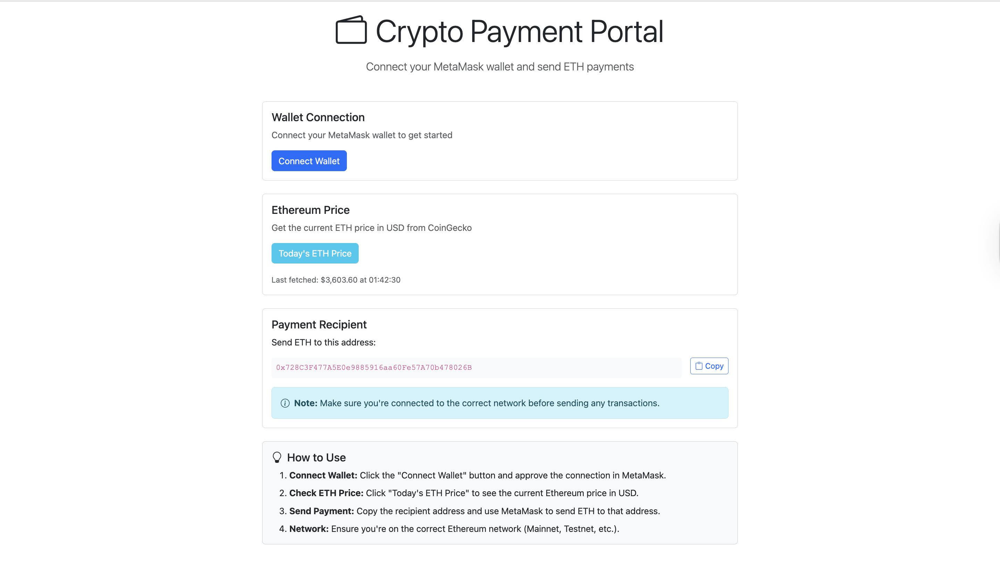

# Crypto Payment Portal - MetaMask Integration

A Next.js application that enables cryptocurrency payments through MetaMask wallet integration. This app demonstrates wallet connection/disconnection, real-time ETH price fetching, and secure payment address management.



## Features

- 🔐 **MetaMask Wallet Connection** - Connect and manage your Ethereum wallet
- 💰 **Live ETH Price** - Fetch current Ethereum price from CoinGecko API
- 📋 **Payment Address Management** - Securely display and copy recipient wallet address
- ⚡ **Real-time Updates** - Automatic updates on account/network changes
- 🔒 **Secure Environment Variables** - Server-side wallet address management

## Tech Stack

- **Framework:** Next.js
- **Blockchain Library:** ethers.js
- **UI Framework:** Bootstrap 5
- **HTTP Client:** Axios
- **API Integration:** CoinGecko API

## Prerequisites

- Node.js 16.x or higher
- npm or yarn package manager
- MetaMask browser extension installed
- An Ethereum wallet address for receiving payments

## Installation

1. **Clone or download this project**

2. **Install dependencies:**

   ```bash
   npm install
   ```

3. **Set up environment variables:**

   Copy the example environment file:

   ```bash
   cp .env.local.example .env.local
   ```

   Edit `.env.local` and replace the placeholder with your actual Ethereum wallet address:

   ```
   RECIPIENT_WALLET=0xYourActualEthereumAddressHere
   ```

   ⚠️ **Important:** Make sure to use a valid Ethereum address (starts with `0x` followed by 40 hexadecimal characters)

## Running the Application

### Development Mode

Start the development server:

```bash
npm run dev
```

The application will be available at [http://localhost:3000](http://localhost:3000)

### Production Build

Build the application for production:

```bash
npm run build
npm start
```

## Key Components

### ConnectWallet Component (`components/ConnectWallet.js`)

Handles MetaMask wallet integration:

- Detects MetaMask installation
- Connects to user's wallet
- Displays connected address and network
- Listens for account and network changes
- Shows installation prompt if MetaMask is not detected

### EthPriceToggle Component (`components/EthPriceToggle.js`)

Fetches and displays Ethereum price:

- Calls CoinGecko API for live ETH-USD price
- Displays price in a Bootstrap alert
- Handles loading states and errors
- Auto-dismisses after 5 seconds

### API Route (`pages/api/crypto/address.js`)

Server-side API endpoint:

- Returns recipient wallet address from environment variables
- Validates the address format
- Returns 500 error if not configured
- Ensures address is never exposed in client code

## Testing Checklist

Follow these steps to verify all functionality:

### 1. Initial Setup

- ✅ Run `npm install` successfully
- ✅ Create `.env.local` with valid `RECIPIENT_WALLET` address
- ✅ Start dev server with `npm run dev`
- ✅ Navigate to `http://localhost:3000`

### 2. MetaMask Detection

- ✅ With MetaMask installed: "Connect Wallet" button appears
- ✅ Without MetaMask: Warning message with install link appears

### 3. Wallet Connection

- ✅ Click "Connect Wallet" button
- ✅ MetaMask popup appears requesting permission
- ✅ After approval, connected address displays
- ✅ Green "Connected" badge appears
- ✅ Current network name displays correctly

### 4. Account Change Detection

- ✅ Open MetaMask and switch to a different account
- ✅ UI automatically updates to show new account address
- ✅ No page reload required

### 5. Network Change Detection

- ✅ Switch networks in MetaMask (e.g., Mainnet to Sepolia)
- ✅ Page reloads automatically
- ✅ New network name displays after reload

### 6. Wallet Disconnection

- ✅ Click "Disconnect Wallet" button
- ✅ Wallet get disconnected
- ✅ Reload page still shows no wallet

### 6. ETH Price Fetching

- ✅ Click "Today's ETH Price" button
- ✅ Loading spinner appears
- ✅ Price displays in green with $ prefix
- ✅ Price formatted to 2 decimal places
- ✅ Alert auto-dismisses after 5 seconds
- ✅ Last fetched price remains visible

### 7. Price Error Handling

- ✅ Disconnect internet (or block CoinGecko API)
- ✅ Click "Today's ETH Price"
- ✅ Error message displays in red alert

### 8. Recipient Address Display

- ✅ Recipient address loads on page load
- ✅ Address displays in monospace font
- ✅ "Copy" button appears next to address
- ✅ Click copy button - shows "Copied!" confirmation
- ✅ Address is copied to clipboard

### 9. Environment Variable Validation

- ✅ Remove or comment out `RECIPIENT_WALLET` in `.env.local`
- ✅ Restart dev server
- ✅ Error message appears in recipient section
- ✅ Error mentions missing `.env.local` configuration

### 10. Responsive Design

- ✅ Test on desktop - full address visible
- ✅ Test on mobile - shortened address visible
- ✅ All buttons and cards responsive
- ✅ Bootstrap components render correctly

## Environment Variables

### Server-Side Variables (`.env.local`)

| Variable           | Description                          | Required | Example                                     |
| ------------------ | ------------------------------------ | -------- | ------------------------------------------- |
| `RECIPIENT_WALLET` | Ethereum address to receive payments | Yes      | `0x742d35Cc6634C0532925a3b844Bc9e7595f0bEb` |

⚠️ **Security Notes:**

- Never commit `.env.local` to version control
- The recipient address is only accessible via the API route
- Client-side code never has direct access to environment variables

## MetaMask Requirements

- **Browser Extension:** MetaMask must be installed in your browser
- **Network:** Works on any Ethereum network (Mainnet, Sepolia, Goerli, etc.)
- **HTTPS/Localhost:** MetaMask only works on HTTPS sites or localhost
- **Permissions:** User must approve wallet connection

## Troubleshooting

### MetaMask Not Detected

- Ensure MetaMask extension is installed and enabled
- Try refreshing the page
- Check browser console for errors

### Wallet Won't Connect

- Make sure you approve the connection in MetaMask popup
- Check if MetaMask is locked - unlock it first
- Try disconnecting and reconnecting

### Price Not Loading

- Check internet connection
- Verify CoinGecko API is accessible
- Check browser console for CORS or network errors

### Recipient Address Error

- Verify `.env.local` file exists in project root
- Ensure `RECIPIENT_WALLET` is set with valid Ethereum address
- Restart the development server after changing `.env.local`

### Page Doesn't Load

- Ensure you're accessing `http://localhost:3000` (not `https`)
- Check that port 3000 is not in use by another application
- Clear browser cache and try again

## Development Notes

### Code Organization

- Components are modular and reusable
- API routes follow Next.js conventions
- Environment variables are server-side only
- Bootstrap classes used throughout for consistency

### Best Practices Implemented

- Error handling on all async operations
- Loading states for better UX
- Input validation on API routes
- Responsive design with Bootstrap
- Clean code with comments
- Security-first approach for wallet addresses
